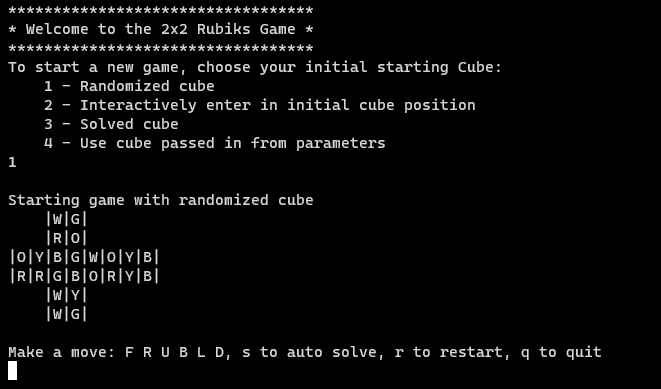

# 2x2 rubiks
An interactive Haskell implementation of the 2x2 Rubiks cube.

This project was developed as part of the Emurgo Blockchain developer course.

Author : Sean 

Credit to solver algorithm, code is based on the following:
 - Brute force  algorithm: https://github.com/KitN/rubiks-two-two
 - Beginner algorithm: https://jperm.net/2x2


## Overview
Allows player to interactively play with a 2x2 rubiks cube displayed in a 2D manner. Player can also choose to enter a batch mode by passing in the -b flag as parameter. By default, game starts interactively.

When you start the game, you can then choose to start with a randomized cube, interactively enter in a starting cube position, start with a solved cube, or start with the cube passed in from the parameters.

Example screenshot below shows the game started interactively and with a randomized cube:



The log of all the moves and its intermediate states are then logged to a log file, the default filename is rubiks.txt

### Cube representation
In the interactive mode, the cube is displayed in a 2D manner, the different faces of the cube are represented in the following layout:

<pre>
    | U |                U - Up face
    |   |                L - Left face
| L | F | R | B |        F - Front face
|   |   |   |   |        R - Right face
    | D |                B - Back face
    |   |                D - Down face
</pre>


### Valid moves
The following are the valid moves:

```
data Move = F  | U  | R  | F' | U' | R' |
            B  | L  | D  | B' | L' | D' |
            F2 | U2 | R2 | B2 | L2 | D2
```

F rotates the front face 90° clockwise.<br>
The ' is to indicate anti-clockwise rotation.<br>
The 2 is to rotate by 180°.


### Help
<pre>
Usage: rubiks [-b|--batch] [-c|--cube ARG] [-m|--moves ARG] [-l|--log LOGFILE]
  2x2 Rubiks cube game

Available options:
  -b,--batch               Enable batch mode
  -c,--cube ARG            Enter initial cube state for batch mode
  -m,--moves ARG           Enter move list for batch mode
  -l,--log LOGFILE         Write rubiks moves history to LOGFILE
  -h,--help                Show this help text
</pre>

### Examples

Start game interactively:
```
cabal -v0 run rubiks
```


## Design
Using Reader Writer State monads (RWS monad)
Using get options package to get the options from the user
A module to represent the cube data type. 
    - Represent via square, face, edge, corner?
    - Also handles pretty printing it. Maybe using colours? System.Console.ANSI
A module to represent the moves
A main module to take in user parameters, and handle the IO part. 

### Detailed Design

A 2x2 cube is represented by:
    - 8 corners

The following is the list of all the corner positions:
    - Front Left Up position (FLU)
    - Front Right Up position (FRU)
    - Front Left Down position (FLD)
    - Front Right Down position (FRD)
    - Back Left Up position (BLU)
    - Back Right Up position (BRU)
    - Back Left Down position (BLD)
    - Back Right Down position (BRD)

The following is the list of all the corner colours:
    - Red White Blue
    - Red White Green
    - Red Blue Yellow
    - Red Green Yellow
    - Orange White Blue
    - Orange White Green
    - Orange Green Yellow
    - Orange Blue Yellow

Solver algorithm:
    - Brute force method.
    - Generate all possible moves for the faces: Front, Up, Right. These moves will be: F, U, R, F', U', R'
    - As there are 6 possible moves, and 2x2 Rubiks cube is solvable with 14 moves. The total number of possibilities are 6^14 = 78,364,164,096
    - Once it finds the solution, log the moves to writer, and the intermediate states.  Log the time taken to find the move, and the final state. Print it out to the user.


## Testing
randomize the cube and then run solve.


## Future Development Goals
Validate cube configuration
    - Will it be possible for me to validate the cube configuration? To ensure what is entered is solvable
    - This website provides some info: 
      https://www.quora.com/Is-it-possible-to-determine-whether-a-Rubiks-Cube-is-solvable-just-by-looking-at-its-scrambled-state
If you provide a current cube configuration and the input to solve, then it will solve it for you
    - it will first check to see if it is solvable
    - then solve it and provide the sequence of steps and each of the outcome of the steps


